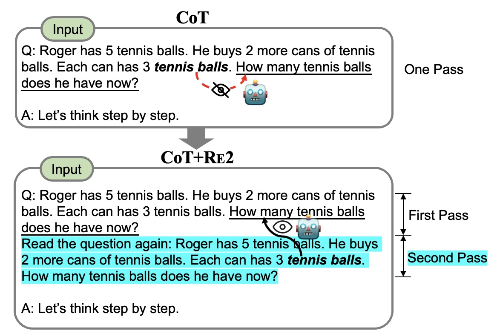

# Rereading-LLM-Reasoning EMNLP 2024 Main 

⭐️ We are honored that Re2 is added into [optillm](https://github.com/codelion/optillm/blob/main/optillm/reread.py), a repo to optimize LLMs' inference.

⭐️ The official code for the paper **EMNLP 2024 "Re-reading improves reasoning in large language models"**. 

**Idea**: ***Simply repeating the question to get "bidirectional" understanding for improving reasoning.***

<!-- Insert 'intro.jpg' image here: -->
<!-- Size is big, so we need to resize it: -->
<p align="center">
  
</p>


## Requirements
```bash
pip install -r requirements.txt
```

Set your OpenAI Key:
```bash
export OPENAI_API_KEY=your_openai_key
```

## Run 

Run `gpt-3.5-turbo-0613` on a dataset to test the code:
```bash
sh run_single_dataset.sh
```


Run `gpt-3.5-turbo-0613` on all datasets:
```bash
sh run.sh
```

The parameter `--multithread` could be added to run the code in parallel to speed up the process a lot.
```bash
python main.py --dataset gsm --temperature 0.0 --acts vanilla cot --model gpt-3.5-turbo-0613 --read_times 2 
```

Run Self-Consistency Experiments: 
```bash
python main.py --dataset gsm --temperature 0.7 --multithread --acts vanilla --num_threads 40 --majority_at 10 
python main.py --dataset gsm --temperature 0.7 --multithread --acts vanilla --num_threads 40 --majority_at 10  --read_times 2 
```

Run Re2 on PAL and Plan-and-Solve prompting methods:
```bash
python main.py --dataset gsm --temperature 0.0 --multithread --acts ps pal --num_threads 40 
python main.py --dataset gsm --temperature 0.0 --verbose --debug --acts ps pal --num_threads 40 --read_times 2 
```

## Evaluation
Evaluation will be done automatically after the generation. Or you could run the evaluation code manually:
```bash
python eval.py --dataset gsm  --acts vanilla cot --eval_file  results/gsm_gpt-4o-mini-2024-07-18_topp1.0_temp0.0_majority1_readtimes1_20240926_221724.jsonl
```


# Citation 

If you find this work helpful, please consider citing our paper:

```
@inproceedings{re2,
  title={Re-reading improves reasoning in large language models},
  author={Xiaohan Xu, Chongyang Tao, Tao Shen, Can Xu, Hongbo Xu, Guodong Long, Jian-Guang Lou, Shuai Ma},
  booktitle={EMNLP},
  year={2024}
}
```

# Acknowledgement
We refer to the code of [PAL](https://github.com/reasoning-machines/pal). Thanks for their contributions.